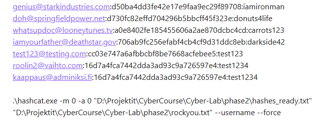
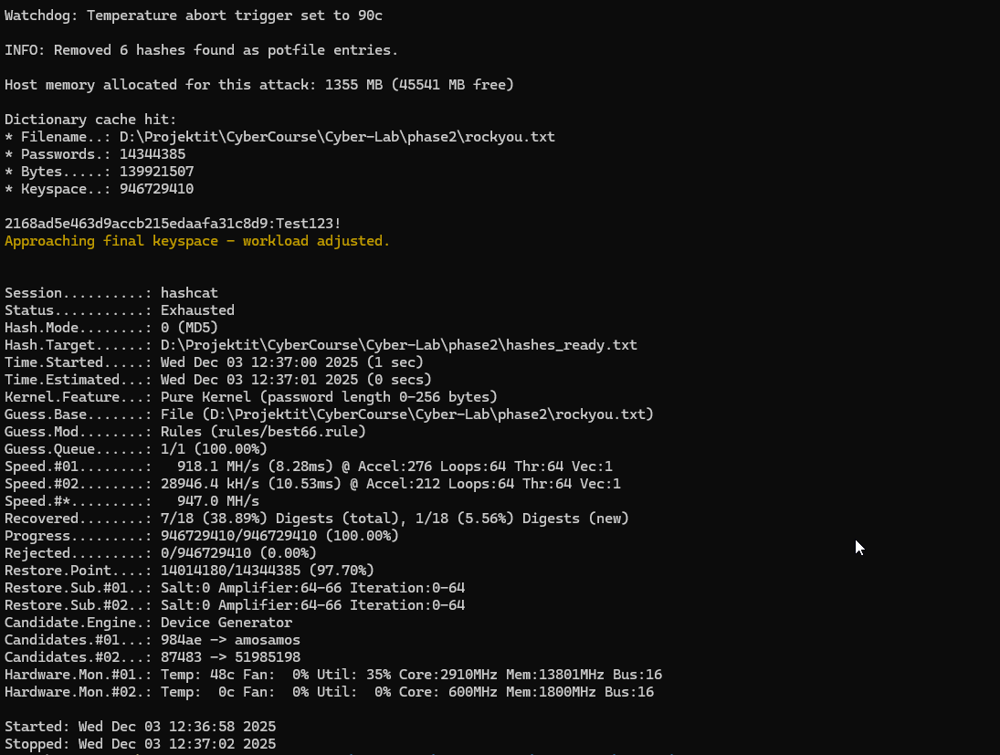
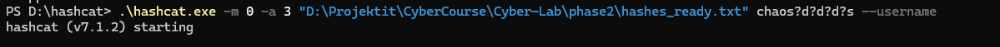
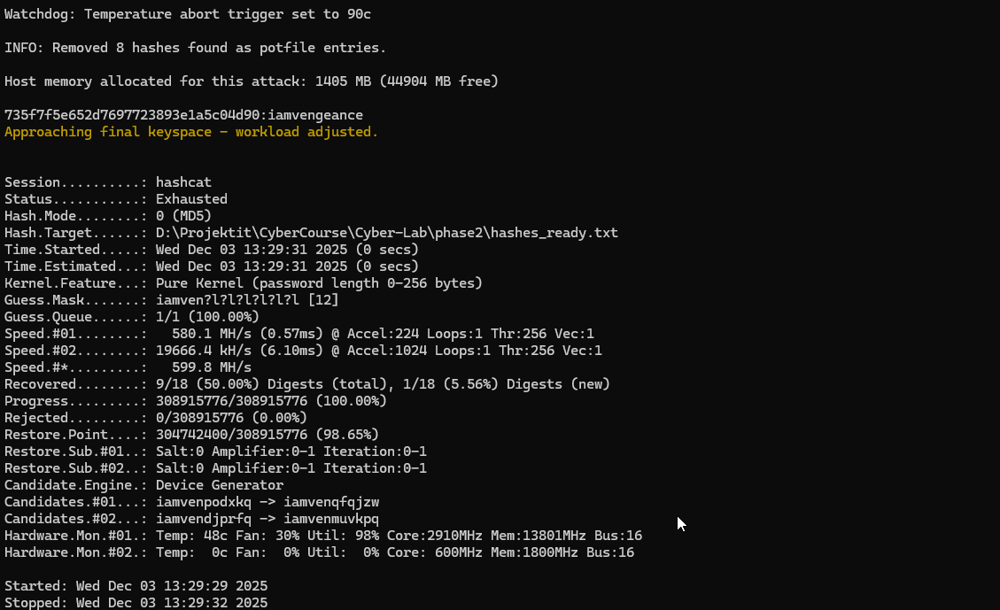

**Tools:** Hashcat v7.1.2  
**Hardware:** NVIDIA GeForce RTX 5070  
**Hash type:** MD5 (`-m 0`)

---

# 1. Cracking Process and Methods

Before starting the cracking process, I reformatted the input file into the Hashcat-compatible `username:hash` structure.  
During the cracking phase, I used three different attack methods:

1. **Dictionary Attack**
    
2. **Rule-Based Attack**
    
3. **Mask Attack (Brute-Force with structure hints)**
    

---

## **Method 1: Dictionary Attack**

In the first phase, I ran the hashes directly against the popular `rockyou.txt` wordlist.  
This method simply tries each word from the list _as-is_.

### **Command**

`.\hashcat.exe -m 0 -a 0 "hashes_ready.txt" "rockyou.txt" --username`

### **Results**

Several passwords were cracked immediately because they exist directly in the wordlist:

`genius@starkindustries.com → iamironman whatsupdoc@looneytunes.tv → carrots123 doh@springfieldpower.net → donuts4life iamyourfather@deathstar.gov → darkside42`

---

## **Method 2: Rule-Based Attack**

One of the remaining passwords did not match the dictionary directly, so I applied Hashcat’s rule engine.  
Rules take a base word from the dictionary and modify it (e.g., capitalization, appending digits, adding symbols).

### **Command**

`.\hashcat.exe -m 0 -a 0 "hashes_ready.txt" "rockyou.txt" -r rules/best66.rule --username`

### **Result**

`child@example.com → Test123!`

**Explanation:**  
The base word “test123” exists in rockyou.txt, and the rule modified it by capitalizing the first letter and adding an exclamation mark.

---

## **Method 3: Mask Attack (Brute-Force with Structural Hints)**

The remaining passwords required a structured brute-force attack (mask attack using `-a 3`).  
I used hints provided in the course material (e.g., known prefix + unknown numeric ending).

### **Joker (whysoserious)**

Hint: password starts with `chaos`, followed by 3 digits and a symbol.

**Command**

`.\hashcat.exe -m 0 -a 3 "hashes_ready.txt" chaos?d?d?d?s --username`

**Result**

`whysoserious@gothamchaos.net → chaos123!`

---

### **Sherlock Holmes (elementary)**

Hint: password begins with `deduction`, includes 3 digits and an uppercase letter.

**Command**

`.\hashcat.exe -m 0 -a 3 "hashes_ready.txt" deduction?d?d?d?u --username`

**Result**

`elementary@221bbaker.uk → deduction221B`

---

### **Batman (darkknight)**

Hint: password begins with `iamven`, followed by six lowercase letters.

**Command**

`.\hashcat.exe -m 0 -a 3 "hashes_ready.txt" iamven?l?l?l?l?l?l --username`

**Result**

`darkknight@gothamwatch.org → iamvengeance`

---

# 2. Answers to the Questions

## **1. What is the main difference between Dictionary and Non-Dictionary attacks?**

### **Dictionary Attack**

Uses a pre-built list of common or leaked passwords (e.g., rockyou.txt).  
Fast and efficient, but it fails if the password is not in the list.

### **Non-Dictionary Attack** (Brute-Force / Mask Attack)

Generates passwords algorithmically by trying all possible combinations, or combinations guided by a structure (mask).

✔ Will eventually find any password  
✘ Extremely slow for long or complex passwords

---

## **2. What advantage does an attacker gain by having access to the system’s database that reveals users and password hashes?**

The main advantage is **offline cracking capability**.

**Benefits to the attacker:**

- **Speed:**  
    GPU can try billions of password attempts per second.  
    Over the login page: maybe a few attempts per second.
    
- **No security controls:**  
    No rate limiting  
    No reCAPTCHA  
    No account lockouts  
    No monitoring
    
- **Full visibility:**  
    The attacker knows:
    
    - hash algorithm (e.g., MD5)
        
    - whether salting is used
        
    - user list & target accounts
        

This dramatically increases the chance of successfully recovering multiple passwords.

---

## **3. What concrete security benefits are achieved by using longer passwords instead of shorter ones?**

Password security increases **exponentially** with length.

### Example:

- 6-character password → can be brute-forced in seconds.
    
- 12-character password → may take centuries to brute-force.
    

Even adding _one extra character_ can multiply the total search space by up to:

- 26× (lowercase)
    
- 52× (uppercase + lowercase)
    
- 62× (alphanumeric)
    
- 95× (all printable characters)
    

**Conclusion:**  
Length is the single strongest defense against brute-force attacks.

## **AI Assistance Disclaimer**

This report was written and completed by me.  
All penetration tests, password cracking attempts, and technical procedures described in this document were performed personally by me.

Artificial intelligence (AI) tools were used **only for assisting with the editing, structuring, and final wording of the report text**, not for performing or automating the security tests themselves.
